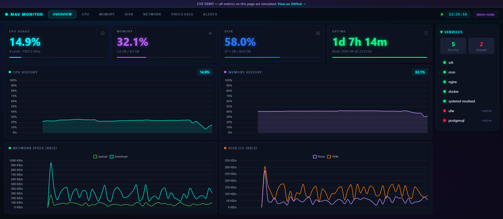

# MAV Monitor

**A single-service system dashboard. No agent, no database, no build step.**

One Python process serves a live dashboard for the machine it runs on — CPU,
memory, disk, network, systemd services, processes, and configurable alerts —
plus an optional, token-gated web terminal. The frontend is a single HTML file
with no bundler and one vendored chart library.

It is meant for the case Prometheus + Grafana + node_exporter is overkill for:
*"I have one box and I want one nice page for it."*

### Good for

- **Standalone machines** — a Raspberry Pi, a home server, a NAS, a single VPS
- **VMs and LXC / Docker containers** — one process, ~47 MB RAM, no sidecars
- **Low-power / thin-client hardware** — measured on a 2 GB Atom box at ~0% idle CPU
- **Air-gapped or offline hosts** — zero outbound connections, no telemetry, no CDN
  at runtime (Chart.js is vendored; only the optional terminal pulls xterm.js)
- **Remote access over a VPN** — keep the default `127.0.0.1` bind and expose it
  through **Tailscale Serve**, WireGuard, or an SSH tunnel; the dashboard is then
  reachable from your devices without opening a port. Example:
  `tailscale serve --bg 8080` → `https://<host>.<tailnet>.ts.net/`

Not built for fleets — one instance watches one machine. For dozens of hosts with
history, alerting pipelines and dashboards, use Prometheus/Grafana or Netdata
Cloud.



**[▶ Live demo](https://xelest.github.io/mav-monitor/)** &nbsp;·&nbsp;
data on the demo is simulated.

---

## Features

- **Overview** — CPU / memory / disk / uptime cards, live CPU, memory, network
  and disk-I/O charts, and a services sidebar
- **Per-resource pages** — per-core CPU + load average, RAM/swap breakdown,
  every mounted partition, per-interface network with addresses
- **Processes** — top N by CPU, with user and status (can be hidden)
- **Alerts** — threshold-based CPU / memory / disk warnings, computed client-side
- **Terminal** *(opt-in)* — full PTY shell over websocket, disabled unless you
  set a token
- **Realtime** — REST poll every 2s; charts keep a client-side history buffer
- **Stateless** — no database, no files written, no telemetry, no outbound calls

## Specs

All figures **measured**, not estimated, on a Dell Wyse 3040 (Intel Atom
x5-Z8350 @ 1.44 GHz, 2 GB RAM) — roughly the slowest hardware you would
realistically run this on. Expect better on anything newer.

### Runtime resource usage

| Resource | Idle | 1 dashboard open | 10 dashboards open |
| --- | --- | --- | --- |
| **RAM** (RSS) | 47 MB | 47 MB | 48 MB |
| **CPU** | 0% | ~2% | ~6% |
| **Threads** | 1 | 1 | 1 |
| **Processes** | 1 | 1 | 1 |

RSS is flat — it does not grow with uptime or with the number of connected
clients (no leak).

### Disk usage

| Item | Size |
| --- | --- |
| Application code | ~350 KB |
| Virtualenv + 5 dependencies | ~30 MB |
| **Total install** | **~30 MB** |
| Data written at runtime | **0 bytes** (nothing is persisted) |
| Docker image (`python:3.12-slim` base) | ~180 MB |

### Response times (same slow box)

| Endpoints | Latency |
| --- | --- |
| `/api/memory`, `/api/disk`, `/api/network` | 7–20 ms |
| `/api/overview`, `/api/cpu`, `/api/metrics`, `/api/processes` | 100–230 ms |

The slower group takes a deliberate 0.1 s `psutil` CPU sample for accuracy —
roughly halve these numbers on a normal CPU.

### Requirements

| | |
| --- | --- |
| Python | 3.9+ |
| OS | Linux (CPU / memory / disk / network work anywhere `psutil` runs; the *Services* panel needs `systemctl`, load average needs POSIX) |
| Dependencies | Flask, Flask-SocketIO, flask-cors, eventlet, psutil |
| Frontend build | none — one HTML file + one vendored JS library |
| Runtime services | none — no database, no cache, no cron, no message broker |
| Network | inbound HTTP only; **zero outbound connections**, no telemetry |

## Quick start

```bash
pipx install git+https://github.com/xelest/mav-monitor.git
mavmon
# http://127.0.0.1:8080
```

Not exposed to the network by default. See **[docs/INSTALL.md](docs/INSTALL.md)**
for Docker and systemd, and **[docs/SECURITY.md](docs/SECURITY.md)** before you
put it on a network.

## Configuration

All via environment variables — nothing is read from a file.

| Variable | Default | Purpose |
| --- | --- | --- |
| `MONITOR_HOST` | `127.0.0.1` | bind address |
| `MONITOR_PORT` | `8080` | bind port |
| `MONITOR_TOKEN` | *(unset)* | require `Authorization: Bearer <token>` on `/api/*` |
| `MONITOR_CORS_ORIGINS` | *(unset)* | allowed origins (comma-separated); unset = same-origin |
| `MONITOR_SERVICES` | `ssh,cron,nginx,docker,systemd-resolved,ufw` | units in the Services panel |
| `MONITOR_HIDE_PROCESSES` | `false` | hide the process list |
| `MONITOR_PROCESS_LIMIT` | `50` | process rows |
| `MONITOR_TERMINAL_TOKEN` | *(unset)* | enable the web shell; sessions must send this token |
| `MONITOR_HISTORY_POINTS` | `60` | chart history length |

```bash
# exposed on a LAN, with auth and a custom service list
MONITOR_HOST=0.0.0.0 \
MONITOR_TOKEN="$(openssl rand -hex 24)" \
MONITOR_SERVICES=ssh,nginx,postgresql,redis-server \
mavmon
```

## HTTP API

| Method | Path | Description |
| --- | --- | --- |
| `GET` | `/` | the dashboard |
| `GET` | `/api/config` | which features are enabled (unauthenticated) |
| `GET` | `/api/overview` | summary cards + tick |
| `GET` | `/api/cpu` | per-core, frequency, load average |
| `GET` | `/api/memory` | RAM + swap |
| `GET` | `/api/disk` | partitions + I/O counters |
| `GET` | `/api/network` | counters + interfaces |
| `GET` | `/api/services` | status of the watched units |
| `GET` | `/api/processes` | top processes |
| `GET` | `/api/metrics` | compact tick for charts |
| `WS` | `/socket.io` | terminal channel (only if enabled) |

Every `/api/*` route except `/api/config` honours `MONITOR_TOKEN`.

## Project layout

```
mav_monitor/
  __main__.py      entrypoint (mavmon)
  config.py        env-var configuration
  metrics.py       psutil collectors
  server.py        Flask app factory + routes + auth
  terminal.py      optional PTY-over-websocket
  static/          index.html + vendored Chart.js
deploy/            systemd unit, Dockerfile, docker-compose
docs/              INSTALL.md, SECURITY.md, demo/ (GitHub Pages)
```

## Development

```bash
git clone https://github.com/xelest/mav-monitor.git
cd mav-monitor
python3 -m venv .venv && .venv/bin/pip install -r requirements.txt
.venv/bin/python -m mav_monitor
```

The demo under `docs/demo/` is the same frontend with `fetch` stubbed by
`demo-data.js` — useful for working on the UI with no backend.

## License

MIT — see [LICENSE](LICENSE).
